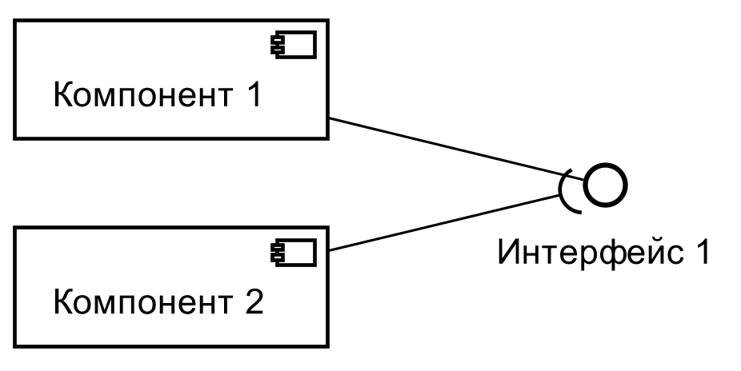

= Основные приемы работы со{nbsp}стилем course-asciidoc
:lang: ru
include::__doc_general_attributes.adoc[]
:doctype: book
:currentfile: db_template_examples.adoc

//tag::body[]
== Общие замечания при использвании стиля в{nbsp}AsciidocFX

https://github.com/asciidocfx/AsciidocFX[AsciidocFX] -- удобная точка, с которой можно начать работать в Asciidoctor. Есть две особенности использования _course-asciidoc_ в этом редакторе.


. Аттрибут _:lang: ru_ должен быть обязательно первым и находиться непосредственно после заголовка в собираемом документе, а не в подключаемом файле.

. Файлы _fo-pdf.xsl_ и _common.xsl_ необходимо скопировать в директорию _conf\docbook-config\_ установки AsciidocFX.

== Изображения

=== Ширина

Основные атрибуты для задания ширины картинок заданы в файле ___doc_general_attributes.adoc_.

Существует два варианта задания ширины

image-[масштаб, кратный 10]-width:: всегда масштабирует картинку вне зависимости от выходного формата
scr-image-[масштаб, кратный 10]-width:: масштабирует картинку только в pdf-документе. Обычно используется для размещения скриншотов.

Предполагается, что масштаб не может быть более 140%.

.Код для примера вставки диаграммы
[source]
```
include::{currentfile}[tags=example_image_1]
```

//tag::example_image_1[]
.Результат вставки

//end::example_image_1[]

=== Рамка вокруг изображения

Чтобы вокруг нарисовать рамка вокруг изображения (обычно используется только в скриншотах, в которых не понятна граница), необходимо для изображения указать роль _image-border_.

.Вставка рамки
[source]
```
include::{currentfile}[tags=example_image_1_ib]
```

//tag::example_image_1_ib[]
[.image-border]
.Рисунок с рамкой (для html требуется настроить стиль CSS)

//end::example_image_1_ib[]


== Альбомная ориентация страниц

К сожалению ориентацию можно изменить только у элементов, определяющих разделы документа. Обычно используется в отношении приложений.

.Пример поворота приложения
[source]
```
include::{currentfile}[tags=example_landscape_appendix]
```

Если необходимо разместить таблицу в альбомной ориентации, предлагается вынести ее в отдельное приложение.


=== Альбомная ориентация рисунков

Рисунок можно размещать в портретном варианте, не вынося в отдельно приложение.

Для этого используйте роль _.img-landscape_.

Предполагается, что рисунок отображается на всю страницу.

.Код для примера вставки диаграммы в альбомной ориентации
[source]
```
include::{currentfile}[tags=example_image_1_l]
```


//tag::example_image_1_l[]

[.img-landscape]
.Результат вставки диаграммы в альбомной ориентации


//end::example_image_1_l[]

== Повтор номеров граф в{nbsp}таблице

По умолчанию в таблицах на каждой странице повторяется первый столбец (если установлен параметр header). Лучше всего с таким поведением согласиться. Но если требуется повторять только номера граф, предлагается следующий убогий вариант.


NOTE: Роль _thcontents_ необходимо использовать обязательно, т.к. иначе возможен перенос посередине заголовка таблицы.

[source,asciidoc]
.Исходный код таблицы, в которой повторяется строка с номерами граф
----
\ifndef::for-print[]
\include::{currentfile}[tags=_t1t]
[cols="1a"]
|===
|
[cols = "1,2"]
!===
\include::{currentfile}[tags=_t1h]
\include::{currentfile}[tags=_t1b]
!===
|===
\endif::[]

\ifdef::for-print[]
[.container]
//tag::_t1t[]
.Таблица, в которой повторяется строка с номерами граф
//end::_t1t[]
[cols = "1a"]
|===
|
[cols = "1,2"]
!===

//tag::_t1h[]

2+^.^![.thcontents]#Общий заголовок#
^.^![.thcontents]#Первый столбец с{nbsp}длинным названием#
^.^![.thcontents]#Второй столбец#

//end::_t1h[]

!===

|
[cols = "1,2", options="header"]
!===
^! 1
^! 2

//tag::_t1b[]

! Значение 1 столбца ! Значение 2 столбца
! Значение 1 столбца ! Значение 2 столбца
! Значение 1 столбца ! Значение 2 столбца
! Значение 1 столбца ! Значение 2 столбца
! Значение 1 столбца ! Значение 2 столбца
! Значение 1 столбца ! Значение 2 столбца
! Значение 1 столбца ! Значение 2 столбца
! Значение 1 столбца ! Значение 2 столбца
! Значение 1 столбца ! Значение 2 столбца
! Значение 1 столбца ! Значение 2 столбца
! Значение 1 столбца ! Значение 2 столбца
! Значение 1 столбца ! Значение 2 столбца
! Значение 1 столбца ! Значение 2 столбца
! Значение 1 столбца ! Значение 2 столбца
! Значение 1 столбца ! Значение 2 столбца
! Значение 1 столбца ! Значение 2 столбца

//end::_t1b[]

!===
|===
\endif::[]
----

Чтобы в html-варианте не было рамки вокруг таблицы, можно убрать ее при помощи CSS. Это можно сделать, например, при помощи файла docinfo.html.

[source, html]
```
include::docinfo.html[]
```

Чтобы содержимое файла _docinfo.html_ помещалось в результирующий файл, необходимо установить атрибут _docinfo_. Для этого в ___doc_general_attributes.adoc_ включены следующие строки.

[source, asciidoc]
```
\ifndef::for-print[]
:docinfo: shared
\endif::[]
```


ifndef::for-print[]
include::{currentfile}[tags=t1t]
[cols="1a"]
|===
|
[cols = "1,2"]
!===
include::{currentfile}[tags=t1h]
include::{currentfile}[tags=t1b]
!===
|===
endif::[]

ifdef::for-print[]
//tag::t1t[]
[.container]
.Таблица, в которой повторяется строка с номерами граф
//end::t1t[]
[cols = "1a"]
|===
|
[cols = "1,2"]
!===

//tag::t1h[]

2+^.^![.thcontents]#Общий заголовок#
^.^![.thcontents]#Первый столбец с{nbsp}длинным названием#
^.^![.thcontents]#Второй столбец#

//end::t1h[]

!===

|
[cols = "1,2", options="header"]
!===
^! 1
^! 2

//tag::t1b[]

! Значение 1 столбца ! Значение 2 столбца
! Значение 1 столбца ! Значение 2 столбца
! Значение 1 столбца ! Значение 2 столбца
! Значение 1 столбца ! Значение 2 столбца
! Значение 1 столбца ! Значение 2 столбца
! Значение 1 столбца ! Значение 2 столбца
! Значение 1 столбца ! Значение 2 столбца
! Значение 1 столбца ! Значение 2 столбца
! Значение 1 столбца ! Значение 2 столбца
! Значение 1 столбца ! Значение 2 столбца
! Значение 1 столбца ! Значение 2 столбца
! Значение 1 столбца ! Значение 2 столбца
! Значение 1 столбца ! Значение 2 столбца
! Значение 1 столбца ! Значение 2 столбца
! Значение 1 столбца ! Значение 2 столбца
! Значение 1 столбца ! Значение 2 столбца

//end::t1b[]

!===
|===
endif::[]


== Нумерация приложений и{nbsp}списков русскими буквами

Стили настроены таким образом, чтобы при экспорте в pdf-формат в нумерации использовались русские буквы. В браузере нумерация определяется стилем CSS.

[loweralpha]
. Первый элемент списка
. Второй элемент списка

//tag::example_landscape_appendix[]

[appendix.landscape]
== Пример приложения
Приложение в pdf отображается в альбомной ориентации.

//end::example_landscape_appendix[]


[discrete]
=== Данный заголовок не попадает в{nbsp}оглавление

Ключевое слово [discrete] говорит о том, что заголовок не надо включать в иерархию заголовков. Т.е. заголовок с этой ролью (1) не попадает в оглавление и (2) может нарушать иерархию.

[appendix]
== Еще пример приложения
=== Пример уровня в{nbsp}приложении
Мы видим, что приложение действительно имеет букву Б, а не B

//end::body[]
